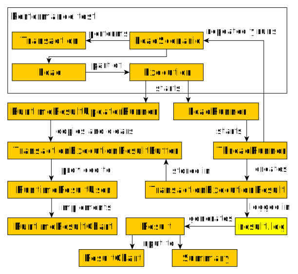

### Loadcoder architecture

A Loadcoder load test consists of three parts.
* LoadScenario is where the logic is implemented for the load threads of the load that is going to be executed. The LoadScenario contains Transactions which is a vital element of the load test. By using Transactions, functionality for result handling, throttling and 

* Load is the definition how the load model should look like, with the LoadScenario as a the base for it. For instance, the Load will define at what intensity and how long the load till execute.

* Execution is the entity that will manage the execution of one to several Loads, as well as hold configuration of how the real time data that comes out of the test shall be used. 

Once the Execution is started, the load test is running.

* A LoadRunner is started for each Load entity that is going to be executed. Each LoadRunner will start it's respective Load's ThreadRunners

* Each ThreadRunner that is started will repeatedlty run the LoadScenario, that will in it's turn cause Transactions to be made.

* A TransactionExecutionResult is created once a Transaction is done. The TransactionExecutionResult contains all information about the made Transaction, such as timestamp, execution time and status. 

* The TransactionExecutionResult is logged into a result file that later can be used to analyze the load test

* After the Execution has finished, a Result can be generated from the result file. The Result can be used as an input to the ResultChart GUI or to generate a textual summary of the test result

Results can be accessed during runtime of a Loadcoder test

* a RuntimeResultUpdaterRunner is started along with the LoadRunners, which will run as long as there are still LoadRunners that executes. 

* The TransactionExecutionResultBuffer is a synchronized List of TransactionExecutionResults. In addition to that all TransactionExecutionResults are logged to the result file, they are also added to the TransactionExecutionResultBuffer. The RuntimeResultUpdaterRunner will periodically move the add TransactionExecutionResults away from the TransactionExecutionResultBuffer into another List that is then provided to a RuntimeResultUser

* The RuntimeResultUser is a functional interface that can be implemented to consume the continuously incoming runtime results. Loadcoder has the built in RuntimeChart implementation that is similar to the post execution ResultChart, but built to accumulate and present the runtime data, optimized for performance over the entire execution.

